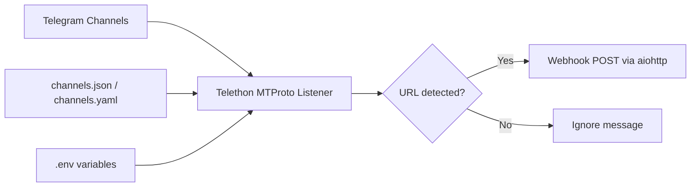

# DealScout

Automated affiliate deal redirection system that listens to Telegram channels via MTProto and forwards qualifying messages to a webhook.

## Overview

DealScout's listener watches configured Telegram channels in real time and forwards messages containing URLs to an automation endpoint (for example, n8n).

## Setup

1. Create a Python virtual environment.
2. Install dependencies:

   ```bash
   pip install -r listener/requirements.txt
   ```

3. Copy the environment template:

   ```bash
   cp listener/.env.example listener/.env
   ```

4. Copy and edit the channel config template:

   ```bash
   cp listener/channels.json.example listener/channels.json
   ```

5. Update your credentials and config values.

## Environment Variables

| Variable | Required | Default | Description |
| --- | --- | --- | --- |
| `TG_API_ID` | Yes | - | Telegram API ID from my.telegram.org |
| `TG_API_HASH` | Yes | - | Telegram API hash from my.telegram.org |
| `TG_PHONE` | Yes | - | Phone number for the Telegram account |
| `DEALSCOUT_SESSION` | No | `dealscout_session` | Local Telethon session file name |
| `DEALSCOUT_CONFIG` | No | `channels.json` | Path to channel config file (JSON or YAML) |

## Channel Config

The listener reads channel configuration at startup from `DEALSCOUT_CONFIG`, so channels can be added/removed without code changes.

Example (`listener/channels.json.example`):

```json
{
  "webhook_url": "http://192.168.1.100:5678/webhook/dealscout",
  "retry_attempts": 3,
  "retry_delay_seconds": 5,
  "channels": [
    { "name": "Example Deal Channel", "id": -1001234567890 },
    { "name": "Another Deals Group", "id": -1009876543210 }
  ]
}
```

## Run

```bash
cd listener
python listener.py
```

## Test

```bash
cd listener
pytest test_listener.py -v
```

## Architecture


