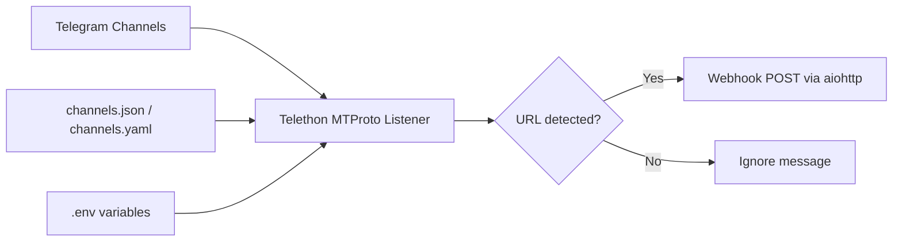

# DealScout

Automated affiliate deal redirection system that listens to Telegram channels via MTProto and forwards qualifying messages to a webhook.

## Overview

DealScout's listener watches configured Telegram channels in real time and forwards messages containing URLs to an automation endpoint (for example, n8n).

In parallel, every message received from monitored channels is archived locally in a CSV file so the message history can be analyzed later like a lightweight database.

The listener now logs each processing step in the terminal, making it easier to confirm when a message is received, archived, and forwarded.

## Setup

1. Create a Python virtual environment.
2. Install dependencies:

   ```bash
   pip install -r listener/requirements.txt
   ```

3. Copy the environment template:

   ```bash
   cp listener/.env.example listener/.env
   ```

4. Copy and edit the channel config template:

   ```bash
   cp listener/channels.json.example listener/channels.json
   ```

5. Update your credentials and config values.

## Docker / Portainer

If you want to run the listener on Umbrel through Portainer, use the root `docker-compose.yml` in this repository.

Important: this compose file uses `build:` and `Dockerfile`, so it must be deployed from a Portainer stack created from a Git repository checkout, not pasted into the plain web editor. If you paste the YAML into the editor without repository context, Portainer will fail with `failed to read dockerfile: open Dockerfile: no such file or directory`.

The stack builds the Python image, stores the Telethon session and CSV under a persistent `/data` directory, and keeps the webhook disabled by default.

In Portainer, choose `Stacks` -> `Add stack` -> `Repository` and point it at this repository so the `Dockerfile` is available during build.

If you are testing on the host first, pull the latest repo and rebuild before running the login flow, otherwise Docker may keep using an older image:

```bash
git pull
docker compose build --no-cache
docker compose run --rm -it dealscout-listener
```

Before starting the stack, make sure the host directory pointed to by `DEALSCOUT_DATA_DIR` contains a `channels.json` file. You can start from `listener/channels.json.example` and copy it into that directory.

Example environment values for the stack:

```bash
TG_API_ID=12345
TG_API_HASH=your_api_hash_here
TG_PHONE=+5511999999999
DEALSCOUT_DATA_DIR=/opt/dealscout
DEALSCOUT_ENABLE_WEBHOOK=false
```

With those values, the container will use:

- `/opt/dealscout/channels.json` for the channel config
- `/opt/dealscout/dealscout_session.session` for the Telegram session
- `/opt/dealscout/message_archive.csv` for the message archive

## Environment Variables

| Variable | Required | Default | Description |
| --- | --- | --- | --- |
| `TG_API_ID` | Yes | - | Telegram API ID from my.telegram.org |
| `TG_API_HASH` | Yes | - | Telegram API hash from my.telegram.org |
| `TG_PHONE` | Yes | - | Phone number for the Telegram account |
| `DEALSCOUT_SESSION` | No | `dealscout_session` | Local Telethon session file name |
| `DEALSCOUT_CONFIG` | No | `channels.json` | Path to channel config file (JSON or YAML) |
| `DEALSCOUT_ARCHIVE_CSV` | No | `message_archive.csv` | Path to the local CSV archive file |
| `DEALSCOUT_ENABLE_WEBHOOK` | No | `false` | Enables webhook delivery when `true` |
| `DEALSCOUT_VERBOSE_STARTUP` | No | `false` | Shows which monitored chats are visible in the session |

## Channel Config

The listener reads channel configuration from `DEALSCOUT_CONFIG` and keeps watching that file while running. Any save/update to the file is reloaded automatically, so channels and retry settings can be changed without restarting the process.

Messages from monitored channels are appended to the CSV archive defined by `DEALSCOUT_ARCHIVE_CSV`. Each row stores the message text, timestamp, channel ID, URL detection flag, and webhook result status.

Webhook delivery is disabled by default. When you want to turn it back on, set `DEALSCOUT_ENABLE_WEBHOOK=true` or add `"webhook_enabled": true` to the channel config.

The CSV also includes richer metadata for future analysis, such as channel title and username, sender details, message length, the list of URLs extracted from the message, and `image_base64` when the message includes a photo.

Structured parsing now runs before archiving and webhook delivery. The listener normalizes each Telegram message, extracts candidate products, and writes one CSV row per detected product. Webhook payloads remain backward compatible and now also include structured product fields plus a `structured_products` array.

### Archive schema (`schema_version=v2`)

New archive files use an extended header with these additional fields:

- `schema_version`
- `all_urls`
- `message_product_index`
- `message_product_count`
- `product_url`
- `product_domain`
- `product_price`
- `price_currency`
- `product_original_price`
- `product_price_text`
- `product_original_price_text`
- `coupon_code`
- `coupon_text`
- `product_description`
- `is_affiliate_url`
- `parse_status`
- `parse_confidence`

The parser currently targets PT-BR / BRL deal messages. Main heuristics:

- URL priority prefers likely product links over shorteners while still flagging affiliate URLs.
- Price extraction favors the current offer price and stores an optional previous price when both appear.
- Coupon parsing separates the coupon code from the surrounding promotional sentence.
- Description extraction removes operational noise such as hashtags, CTA lines, raw links, and tracking leftovers.

Known limitations:

- Messages with very noisy formatting or multiple links for the same product may still require manual review.
- Product grouping is line/paragraph based, so malformed multi-product messages can generate imperfect splits.
- Currency and language handling are intentionally limited to BRL/PT-BR for now.

If an existing CSV already has the old header, the listener preserves that history and starts writing the new schema into a versioned sibling file such as `message_archive_v2.csv`.

Example (`listener/channels.json.example`):

```json
{
  "webhook_url": "http://192.168.1.100:5678/webhook/dealscout",
   "webhook_enabled": false,
  "retry_attempts": 3,
  "retry_delay_seconds": 5,
  "channels": [
    { "name": "Example Deal Channel", "id": -1001234567890 },
    { "name": "Another Deals Group", "id": -1009876543210 }
  ]
}
```

## Run

```bash
cd listener
python listener.py
```

## Test

```bash
cd listener
pytest test_listener.py -v
```

## Architecture


